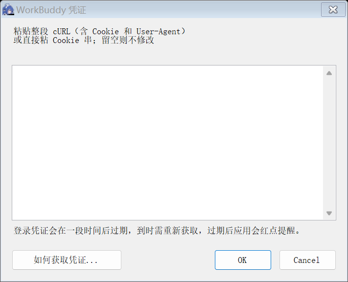

# WorkBuddy PointPal（积分桌宠）

> 一只贴在桌面上的小挂件：角色举着一块平板，屏幕上实时显示你的 **WorkBuddy 积分余额**。
> 余额每下降一个「扣费步长」（默认 **1 积分**），角色就红闪一下 + 轻微震动，同时播放一次打击音效，
> 头顶弹出红色的 **-1** 向上飘并渐隐——数字和屏幕文字会**跟着角色一起抖**。

Windows 10 / 11 · 免安装 · 无需 Node / .NET SDK · 不联网也能跑（离线时屏幕显示 `--`）

---

## 下载

前往 **[最新 Release](https://github.com/Realfie57/workbuddy-pointpal/releases/latest)** 下载：

| 文件 | 说明 |
|---|---|
| `WorkBuddyPointPal-Setup-v1.2.16.exe` | **向导式安装包（推荐）**。可选安装目录、桌面/开始菜单快捷方式、开机自启、「WorkBuddy & PointPal」双启动器 |
| `WorkBuddyPointPal-Portable-v1.2.16.zip` | **便携版**，解压即用，不写注册表、不进「应用和功能」 |

> 首次运行会弹出一个凭证输入框——WorkBuddy 没有公开 API Key，需要你从浏览器复制一次登录凭证
> （一段 cURL 即可，程序自动提取 Cookie + User-Agent）。见下方「第一次使用」。

---

## 截图

| 桌宠本体 | 设置登录凭证 |
|---|---|
|  |  |

---

## 第一次使用

1. 浏览器打开 [www.workbuddy.cn](https://www.workbuddy.cn) 并登录；
2. 按 `F12` → **Network（网络）** → 选择查看 **Doc（文档）** 类型的请求 → **刷新页面**；
3. 找到 `www.workbuddy.cn`，**右键** →「复制」→「**以 cURL 格式复制**」（bash）；
4. 回到桌宠，在弹出的输入框里**整段粘贴**。

程序会自动提取 Cookie 和 User-Agent 并校验。凭证输入框左下角有「**如何获取凭证...**」按钮，
忘了步骤随时点开。安装后也能随时**右键桌宠 →「设置登录凭证」**重新设置。

> **为什么必须带 User-Agent？** 网关把登录会话**绑定到浏览器 User-Agent**——
> 同一 Cookie，UA 差一个版本号都 401；只粘 Cookie 不粘 UA 也 401。
> 整段 cURL 两者都含，是最稳的方式。
>
> **凭证会过期**：登录凭证本质是浏览器会话，过一段时间会失效。失效后接口返回 401，
> 屏幕角落会**亮起红点**提醒你，重新复制一次即可。

---

## 常用操作

| 操作 | 效果 |
|---|---|
| **左键拖动** | 移动桌宠；松手吸附到当前屏幕左下角 |
| **右键** | 打开菜单：设置登录凭证 / 刷新余额 / 尺寸 / 字号 / 步长 / 音效 / 切换角色 / 左右侧 / 关于 / 退出 |
| **双击** | 立即刷新一次余额 |
| **托盘图标右键** | 同上菜单（含「立即刷新」「设置登录凭证」） |

余额下降时红闪 + 音效 + `-N` 飘字；余额**上升**时显示绿色提示，不播放打击音效。

---

## 检查更新

右键 →「**关于…**」→ 左下角「**检查更新**」：关于框关闭，弹出「正在检查更新…」，
查到后**至少停留 0.7 秒**再给结果——已是最新就显示当前版本号，有新版本就并列显示新旧两个号，
并给一个「**打开下载页面**」按钮跳到 GitHub。

> **只提示，不自动更新。** 程序不会偷偷下载或替换文件。不点「检查更新」就完全没有网络请求。
>
> 实现在读 `github.com` 对 `/releases/latest` 的 **302 跳转**（而不是调 `api.github.com`），
> 因此**不消耗 GitHub API 限额**；版本号按**逐段整数**比较，`1.2.9` 不会被误判成比 `1.2.13` 新。
> 想验证这条路径在你网络下通不通：`.\WorkBuddy PointPal.exe --updnet cli/cli`

---

## 可选配置

全部通过环境变量（不设就用默认值）：

| 变量 | 默认 | 说明 |
|---|---|---|
| `WBPET_STEP` | `1` | 扣费步长（积分） |
| `WBPET_SCALE` | `8` | 角色高度（cm）；宽度按比例自动 |
| `WBPET_SOUND` | `1` | 置 `0` 静音 |
| `WBPET_INTERVAL` | `60` | 轮询间隔（秒） |
| `WBPET_UI_SCALE` | — | 弹窗缩放倍数（`1` / `1.5` / `2`），调试用 |

其余（字号、角色、吸附侧、屏幕标签等）都在右键菜单里改，自动存进 `state.ini`。

---

## 它是怎么工作的

```
POST https://www.workbuddy.cn/billing/meter/get-user-resource-summary
headers: Cookie: <会话>     ← 从你粘贴的 cURL 里提取
         User-Agent: <UA>   ← 网关把会话绑在 UA 上
response: { "code": 0, "data": { "Packages": [ ... ] } }
```

积分 = `data.Packages[].cycleRemain` 求和。程序取到数后只做本地差账：
比上一次低了多少，就按步长折算成几次红闪 / 音效 / 飘字。**不做任何上报**，凭证只存在本机。

- 数据目录：`%LOCALAPPDATA%\WorkBuddy PointPal\`（`token.txt` / `state.ini` / `pet.log`）
- 便携版与安装版共用同一数据目录，换版不用重新粘贴凭证

---

## 从源码构建

不需要装 .NET SDK——构建脚本直接用 Windows 自带的 **.NET Framework CodeDom 编译器**
（`CSharpCodeProvider`）把 C# 打进单文件 exe。

```powershell
cd build
# 1) 编译桌宠（产出 ../WorkBuddy PointPal.exe）
powershell -NoProfile -ExecutionPolicy Bypass -File _build_pet_inline.ps1
# 2) 连锁编译 卸载器 → 安装包（产出 ../Uninstall.exe 与 ../WorkBuddy PointPal Setup.exe）
powershell -NoProfile -ExecutionPolicy Bypass -File _build_setup_inline.ps1
```

> 必须用 `powershell.exe -NoProfile -ExecutionPolicy Bypass -File <脚本>` 调用；
> 在 PowerShell 里用 `& script.ps1` 在某些环境下会静默失败。

### 目录结构

```
.
├── src/                       源码
│   ├── wb_pet.cs              主程序（窗口 / 动画 / 音效 / 轮询 / 菜单 / exe 入口）
│   ├── setup.cs               安装向导
│   ├── uninstall.cs           卸载程序
│   ├── _asm_pet.cs            程序集元数据（FileVersion / Product / Publisher）
│   ├── _asm_setup.cs
│   ├── _asm_uninstall.cs
│   └── wb_pet.ps1             PowerShell 版启动器（编译加载 wb_pet.cs 后运行）
├── build/                     构建脚本
│   ├── _build_pet_inline.ps1
│   ├── _build_setup_inline.ps1
│   ├── build_exe.ps1          早期版本，保留备查
│   ├── build_setup.ps1
│   └── make_sprite.ps1        从原图重新生成 sprite.png 并量出黑屏四角
├── sprite.png                 角色贴图（黑屏留给余额文字）
├── hit.mp3                    打击音效
├── characters/                可选角色（Claude / Gemini / GPT / DSH）
├── DaFeiYu.ico                应用图标（exe / 托盘 / 输入框）
├── WorkBuddy_fake_icon.ico    双启动器快捷方式专属图标
├── _payload_bundle_launcher.vbs  「WorkBuddy & PointPal」双启动器载荷（UTF-16LE+BOM）
├── 启动 WorkBuddy PointPal.vbs  脚本版启动器（静默无黑框）
├── 启动（调试窗口）.cmd        出问题时用，能看到报错
├── 先看这里（快速开始）.md     给收件人看的简版说明
└── docs/说明文档.md            完整文档（原理 / 排错 / 改图改音效 / 自检命令）
```

源码里 `setup.cs` / `uninstall.cs` 是**原始 UTF-8 中文**（编译带 `/codepage:65001`），
`wb_pet.cs` 是 **`\uXXXX` 转义**——这是刻意为之：PowerShell 5.1 读无 BOM 的 `.ps1` 会按 ANSI 解析，
所以 UI 文案全部转义存放，中文在任何代码页下都不会乱码。

---

## 自检命令

桌宠内置了一批离线自检模式，不写用户数据、不联网：

```powershell
.\WorkBuddy PointPal.exe --selftest        # 渲染一帧并打印尺寸/账本状态
.\WorkBuddy PointPal.exe --simchain        # 喂模拟余额，检查按步长扣费 + 拆步长补扣 + 演示不冻结
.\WorkBuddy PointPal.exe --soundtest       # 音效逻辑
.\WorkBuddy PointPal.exe --credtest        # 凭证解析器（内置"用户 token.txt 未被改动"守卫）
.\WorkBuddy PointPal.exe --abouttest       # 菜单序位 + 版本
.\WorkBuddy PointPal.exe --toksheet x.png  # 把凭证弹窗渲染成图，并打印布局自检
.\WorkBuddy PointPal.exe --updtest         # 检查更新：14 组版本号比较 + URL 形状 + 0.7s 下限（离线）
.\WorkBuddy PointPal.exe --updnet cli/cli  # 检查更新：唯一联网模式，验证 302 跳转路径可用
```

`Setup.exe /CHECKONLY` 只检查本机是否已安装，不做任何改动（退出码 0 = 已安装 / 1 = 未安装）。
`Setup.exe /SHOTWIZARD=<目录>` 把向导每一页渲染成图。

---

## 关于这个项目

本项目是 **[DSH 余额桌宠](https://github.com/VKmich16/VK-1)**（Windows 原版，作者 **VKmich16**）
的改编版：**美术形象、动画、音效、账本架构完全沿用原作**，数据源从 DeepSeek 余额换成 WorkBuddy 积分接口，
并做了大量工程化改造（单文件 exe 打包、向导式安装包、凭证弹窗、高 DPI 适配、离线自检、
检查更新、双启动器）。

桌面挂件这一整套「手持平板 + 扣费红闪 + `-N` 飘字 + Q 弹音效」的形态，源头是
**[MeteorNOX/DeepSeek-Balance-Whale-Widget](https://github.com/MeteorNOX/DeepSeek-Balance-Whale-Widget)**
（DSH 界面里的小鲸鱼余额挂件），这里也一并致谢。

**感谢以上原作者，没有他们的工作就没有这个项目。** 详细来源与授权说明见 [LICENSE](LICENSE)。

### 贡献者

除了原作者，还要特别感谢在开发过程中实机测试、报 bug 的朋友：

| 贡献者 | 贡献 |
|---|---|
| [@lvxq8](https://github.com/lvxq8) | 多轮实机测试与缺陷报告：非系统盘（`E:\`）安装下双启动器失效、凭证流程边界情况等，直接推动了 v1.2.16 的修复 |

欢迎提交 [Issue](https://github.com/Realfie57/workbuddy-pointpal/issues) 反馈问题，你的每一次实测反馈都会被认真对待。

> 本项目与 WorkBuddy 官方无关，是非官方第三方挂件。凭证只保存在你自己电脑上，
> 程序除了向 WorkBuddy 计费接口读余额之外不做任何网络请求。

---

## 许可证

本项目**自身代码**以 [MIT](LICENSE) 授权。
**美术素材（`sprite*.png`、`characters/`、`hit.mp3`）与源自上游的账本架构不属于 MIT 授权范围**——
上游 [VKmich16/VK-1](https://github.com/VKmich16/VK-1) 明确声明「暂未附带许可证，不对上游代码和素材另行授予许可」，
故这些素材**仅随本项目的安装包原样分发**，请勿单独提取再分发或商用。详见 [LICENSE](LICENSE)。
